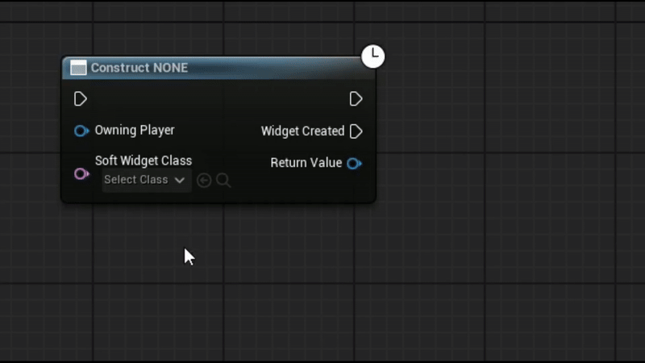
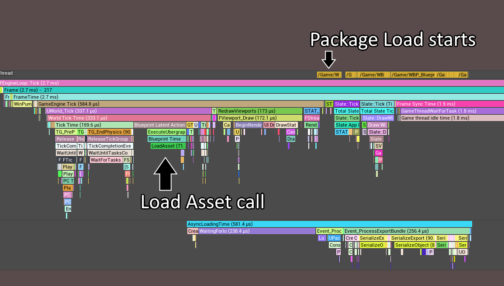
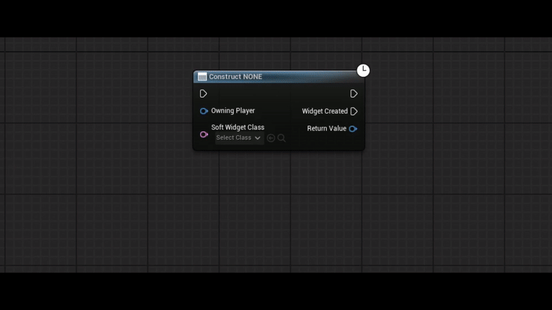
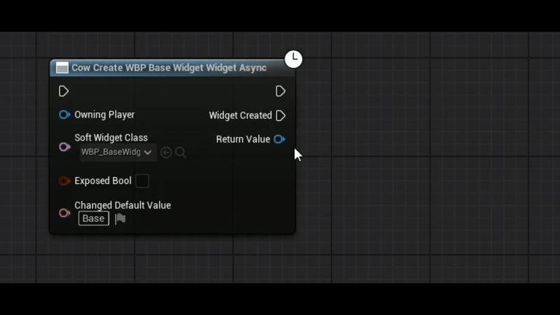

  

# About
I was frankly tired of using `CreateWidgetAsync` with no convenient option to assign properties without introducing hard-ref.

Hopefully the name `Cow Nodes` will become true someday and there will be more public nodes but everything needs to be started at some point.

# List of nodes:

- [`CowCreateWidgetAsync` - Ultimate Create Widget Async](#CowCreateWidgetAsync)

# CowCreateWidgetAsync
Improved Version of Epic's `CreateWidget` and `CreateWidgetAsync` (from `CommonGame`)

This version combines the best of both worlds with general quality-of-life improvements  

## Key Features

- **No Hard References**: Does not introduce a hard reference to the selected widget class in packaged game (similar to `CreateWidgetAsync`).  
  

- **ExposedOnSpawn Parameters**: Displays any `ExposedOnSpawn` parameters (similar to `CreateWidget`).
- **Automatic Handling of `ExposedOnSpawn` Variables**: Automatically adds new `ExposedOnSpawn` variables (which `CreateWidget` does not handle).
- **Widget Class Pin Enhancements**:
    - Supports linked properties and propagates their class.
    - Example:
        
        Suppose you created a soft class property `MyClass` of type `WBP_BaseWidget` with an exposed member `Text` (so only `WBP_BaseWidget` and derived classes can be selected).
        
        If you connect `MyClass` property to the node, it will properly:
        
        1. Display any exposed members (`Text` will be shown).
        2. Set the return type of the node to `WBP_BaseWidget`.
        (Because the pin type already introduces a hard reference (`SoftClass` property to a type `X` is a hard reference to `X`)
        
- **Optimal Return Value**: The return value is always the best possible option that avoids a hard reference.
It will be either the first native class or the widget class if linked to a pin that introduced a hard reference.
- **Improved Auto-Wiring**: Proper auto-wiring for `ReturnType` to avoid the common mistake of using the `Then` pin instead of `OnWidgetCompleted`.  
  
- **User-Friendly Notes**: Generates informative notes when actions might cause errors.
    - Introduction of a hard reference.
    - Keeping default values of the base class when a pin of the base class is hooked, which may differ at runtime.
- **Fix for `FKismetCompilerUtilities::GenerateAssignmentNodes`**:
    - Prevents `DynamicCast` from creating a hard reference through native properties with `BlueprintSetter`.
    - See `FCowCompilerUtilities::GenerateAssignmentNodes` for implementation details.

## Known Limitations

1. Works only with **EventGraph/Macro** (due to being async).
2. No support for **conflicting names** (e.g., an `ExposedVar` named `"SoftWidgetClass"` will cause an error during node compilation).
3. **One-frame delay** even if the soft reference is already loaded due to `LoadAsset` (TODO).
4. **Editor Limitation**: In the editor, the node holds a **hard reference** to the `WidgetClass`.
This is required for pin generation and proper reloading when `WidgetClass` changes.
